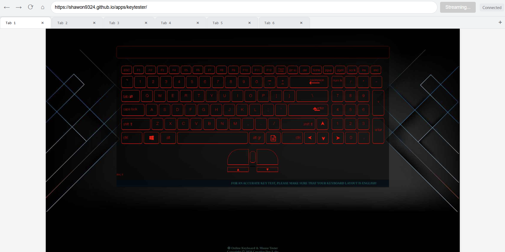
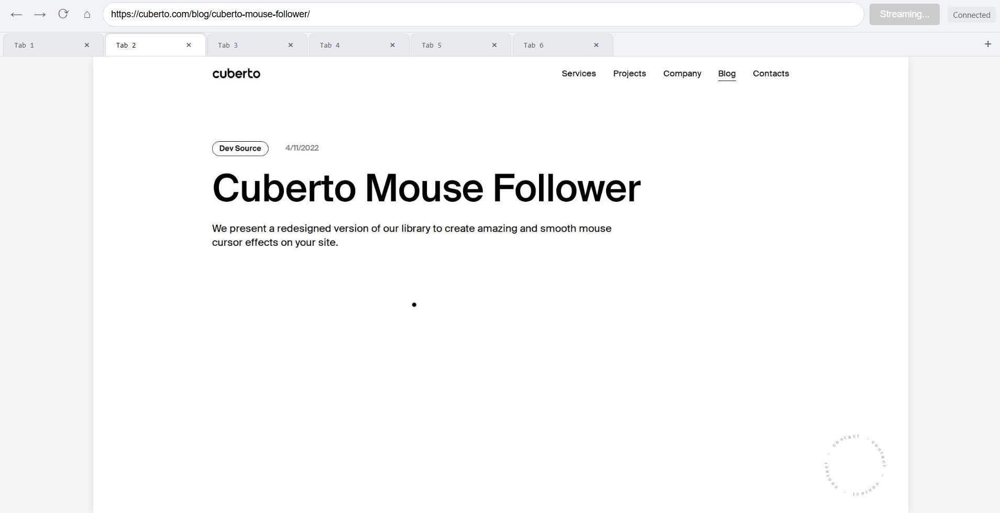
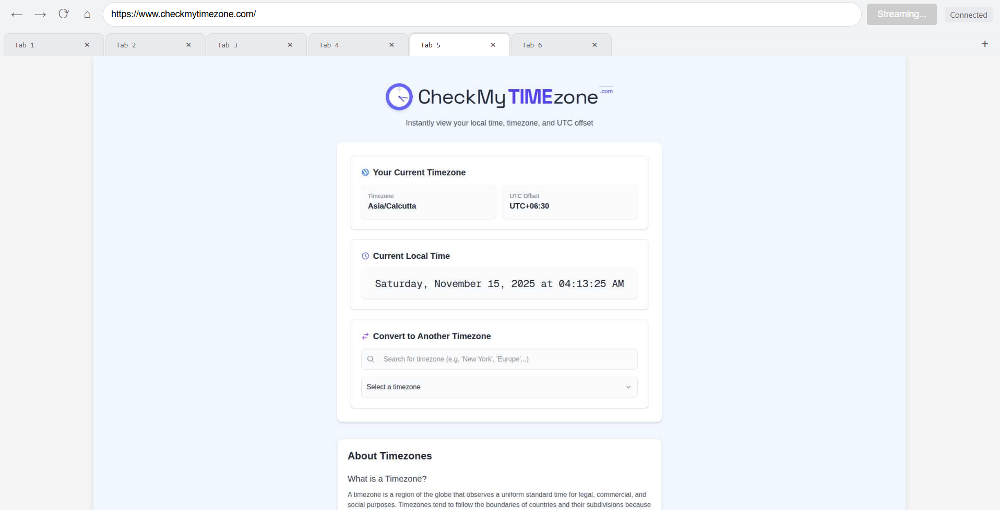
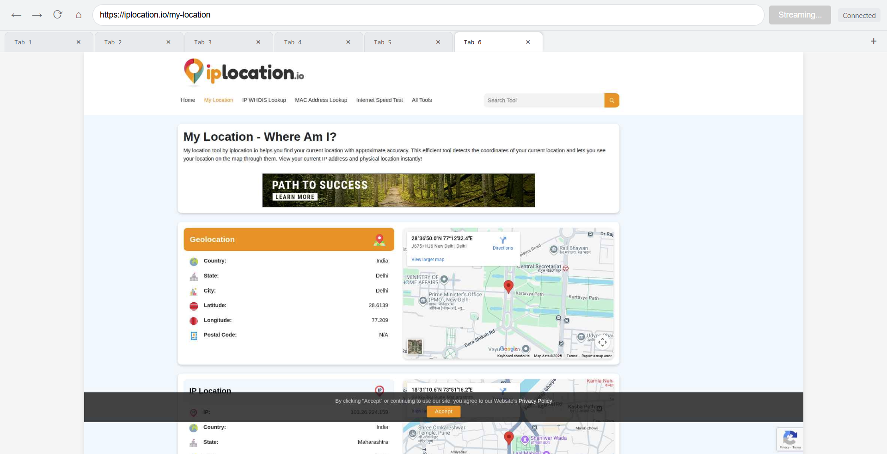

# Remote Browser Stream

A real-time browser streaming and remote control system built with Django Channels and Playwright. Stream browser screenshots via WebSocket and interact remotely with mouse, keyboard, and navigation controls. Supports multi-tab management and low-latency video streaming.

## Features

- 🖥️ **Real-time Browser Streaming**: Stream browser screenshots in real-time via WebSocket with configurable FPS and quality
- 🖱️ **Remote Mouse Control**: Full mouse interaction support including movement, clicks, and scrolling
- ⌨️ **Remote Keyboard Control**: Complete keyboard input with modifier key support (Ctrl, Alt, Shift, Meta)
- 📑 **Multi-tab Management**: Create, switch, and close multiple browser tabs seamlessly
- 🧭 **Browser Navigation**: Navigate back, forward, refresh, and go to specific URLs
- ⚡ **Low-latency Streaming**: Optimized JPEG compression and efficient WebSocket binary frame transmission
- 🎨 **Modern Web UI**: Browser-like interface with toolbar, address bar, and tab management
- 🏗️ **Clean Architecture**: Well-structured codebase using multiple design patterns for maintainability

## Screenshots

### Application Interface

The application provides a browser-like interface for remote browser control:


*Main application interface showing the browser toolbar, address bar, and streaming canvas*


*Demonstrating interactive features and mouse control capabilities*


*Multi-tab management interface with multiple open tabs*


*Advanced controls and navigation features in action*

## Tech Stack

- **Backend Framework**: Django 5.2.6
- **WebSocket**: Django Channels
- **Browser Automation**: Playwright
- **Image Processing**: OpenCV, Pillow
- **ASGI Server**: Daphne
- **Frontend**: Vanilla JavaScript, HTML5 Canvas
- **Channel Layer**: In-memory (configurable for Redis in production)

## Architecture

The codebase utilizes several design patterns for a decoupled, maintainable architecture:

### Design Patterns

- **Facade**: `VideoStreamConsumer` simplifies the entry point to the system
- **Strategy**: `MessageRouter` uses different Handler objects to process various message types
- **Adapter**: Handler classes adapt WebSocket data for the Controller classes
- **Command**: `MessageRouter` maps message types to handler methods
- **Dependency Injection**: `VideoStreamConsumer` dynamically creates and injects dependencies
- **Data Mapper**: `KeyMapper` and `ButtonMapper` translate data between client and server formats
- **Lazy Initialization**: Resources are allocated only when a 'start' command is received
- **Callback**: `ScreenshotStreamer` uses a callback to send frames, decoupling frame generation from the WebSocket

### System Components

- **VideoStreamConsumer**: Main WebSocket consumer coordinating all operations
- **BrowserManager**: Manages Playwright browser instance and context
- **PageManager**: Handles page/tab operations (create, switch, close)
- **NavigationManager**: Manages browser navigation (back, forward, refresh, goto)
- **InteractionManager**: Coordinates mouse and keyboard controllers
- **ScreenshotStreamer**: Captures and streams browser screenshots
- **MessageRouter**: Routes WebSocket messages to appropriate handlers
- **Event Handlers**: Process mouse and keyboard events

## Installation

### Prerequisites

- Python 3.8 or higher
- pip (Python package manager)
- Playwright browsers (installed automatically with Playwright)

### Step 1: Clone the Repository

```bash
git clone <repository-url>
cd websocketstreaming
```

### Step 2: Create Virtual Environment

```bash
python -m venv venv
source venv/bin/activate  # On Windows: venv\Scripts\activate
```

### Step 3: Install Dependencies

```bash
pip install -r requirements.txt
```

### Step 4: Install Playwright Browsers

```bash
playwright install chromium
```

## Configuration

Configuration is managed in `livecanvas/config.py`. Key settings include:

```python
# Browser configuration
BROWSER_URL: str = "https://example.com"  # Default URL to open
CANVAS_WIDTH: int = 1920                   # Browser viewport width
CANVAS_HEIGHT: int = 1080                  # Browser viewport height
STREAMING_FPS: float = 15.0                # Frames per second
STREAMING_QUALITY: int = 40                # JPEG quality (1-100)

# Browser settings
HEADLESS: bool = True                      # Run browser in headless mode
TESTING: bool = True                       # Enable testing mode with multiple tabs
```

### Testing URLs

The application includes a list of testing URLs that can be opened automatically in testing mode:

```python
TESTING_URLS: List[str] = [
    "https://shawon9324.github.io/apps/keytester/",
    "https://cuberto.com/blog/cuberto-mouse-follower/",
    "https://www.w3schools.com/tags/att_a_target.asp",
    "https://codepen.io/calebnance/full/nXPaKN",
    "https://www.checkmytimezone.com/",
    "https://iplocation.io/my-location"
]
```

## Usage

### Starting the Server

Run the Django Channels ASGI server using Daphne:

```bash
daphne -p 7979 livecanvas.asgi:application
```

The server will start on `http://localhost:7979`

### Accessing the Application

1. Open your web browser and navigate to `http://localhost:7979`
2. Click the "Start" button to initiate the WebSocket connection and begin streaming
3. The browser will launch (headless by default) and start streaming screenshots
4. Interact with the canvas using your mouse and keyboard

### Controls

- **Mouse**: Click, drag, and scroll on the canvas to interact with the remote browser
- **Keyboard**: Type on the canvas (when focused) to send keyboard input
- **Navigation Buttons**: Use back, forward, refresh, and home buttons in the toolbar
- **Address Bar**: Enter a URL and press Enter to navigate
- **Tabs**: Click tabs to switch between pages, or use the "+" button to create new tabs
- **Close Tabs**: Click the "×" button on tabs to close them (minimum one tab must remain)

## WebSocket API

The application uses WebSocket for bidirectional communication. Messages are sent as JSON (text) or binary (JPEG frames).

### Client to Server Messages

#### Start Streaming
```json
{
  "type": "start"
}
```
Initiates browser launch and starts streaming.

#### Mouse Events

**Mouse Move**
```json
{
  "type": "mousemove",
  "x": 500,
  "y": 300
}
```

**Mouse Down**
```json
{
  "type": "mousedown",
  "x": 500,
  "y": 300,
  "button": "left"  // "left", "middle", or "right"
}
```

**Mouse Up**
```json
{
  "type": "mouseup",
  "x": 500,
  "y": 300,
  "button": "left"
}
```

**Wheel/Scroll**
```json
{
  "type": "wheel",
  "x": 500,
  "y": 300,
  "deltaX": 0,
  "deltaY": 100
}
```

#### Keyboard Events

**Key Down**
```json
{
  "type": "keydown",
  "key": "a",
  "code": "KeyA",
  "ctrlKey": false,
  "altKey": false,
  "shiftKey": false,
  "metaKey": false,
  "repeat": false
}
```

**Key Up**
```json
{
  "type": "keyup",
  "key": "a",
  "code": "KeyA",
  "ctrlKey": false,
  "altKey": false,
  "shiftKey": false,
  "metaKey": false
}
```

#### Navigation

```json
{
  "type": "navigate",
  "action": "back"  // "back", "forward", "refresh", or "goto"
}
```

For "goto" action:
```json
{
  "type": "navigate",
  "action": "goto",
  "url": "https://example.com"
}
```

#### Page Management

**Switch Page**
```json
{
  "type": "page_switch",
  "page_id": "uuid-string"
}
```

**Create New Tab**
```json
{
  "type": "new_tab"
}
```

**Close Tab**
```json
{
  "type": "close_tab",
  "page_id": "uuid-string"
}
```

### Server to Client Messages

#### Binary Frames
Binary messages contain JPEG-encoded screenshot frames. These are sent continuously during streaming.

#### Control Messages

**Error**
```json
{
  "type": "error",
  "message": "Error description"
}
```

**Page Added**
```json
{
  "type": "page_added",
  "page_id": "uuid-string"
}
```

**Page Removed**
```json
{
  "type": "page_removed",
  "page_id": "uuid-string"
}
```

**Pages Sync**
```json
{
  "type": "pages_sync",
  "page_ids": ["uuid1", "uuid2", "uuid3"]
}
```

**Page Switched**
```json
{
  "type": "page_switched",
  "page_id": "uuid-string",
  "url": "https://current-url.com"
}
```

**URL Changed**
```json
{
  "type": "url_changed",
  "url": "https://new-url.com"
}
```

## Project Structure

```
websocketstreaming/
├── livecanvas/              # Main Django application
│   ├── consumers.py        # WebSocket consumer
│   ├── config.py           # Configuration settings
│   ├── routing.py          # WebSocket URL routing
│   ├── settings.py         # Django settings
│   ├── urls.py             # HTTP URL routing
│   ├── views.py            # HTTP views
│   ├── asgi.py             # ASGI application
│   ├── controllers/        # Browser interaction controllers
│   │   ├── keyboard_controller.py
│   │   └── mouse_controller.py
│   ├── event_handlers/     # WebSocket event handlers
│   │   ├── base_handler.py
│   │   ├── keyboard_handler.py
│   │   └── mouse_handler.py
│   ├── managers/           # Business logic managers
│   │   ├── browser_manager.py
│   │   ├── interaction_manager.py
│   │   ├── message_router.py
│   │   ├── navigation_manager.py
│   │   ├── page_event_coordinator.py
│   │   ├── page_manager.py
│   │   └── websocket_message_sender.py
│   ├── mappers/            # Data transformation mappers
│   ├── streaming/          # Screenshot streaming
│   │   └── screenshot_streamer.py
│   └── utils/              # Utility functions
│       └── validators.py
├── templates/              # HTML templates
│   └── index.html
├── static/                 # Static files
│   ├── css/
│   │   └── style.css
│   └── js/
│       └── main.js
├── images/                 # Screenshots for documentation
├── requirements.txt        # Python dependencies
├── manage.py              # Django management script
└── README.md              # This file
```

## Development

### Running in Development Mode

1. Set `DEBUG = True` in `livecanvas/settings.py` (default)
2. Set `HEADLESS = False` in `livecanvas/config.py` to see the browser window
3. Run migrations (if using database features):
   ```bash
   python manage.py migrate
   ```
4. Start the development server:
   ```bash
   daphne -p 7979 livecanvas.asgi:application
   ```

### Code Style

The codebase follows Python PEP 8 style guidelines. Key architectural principles:

- **Separation of Concerns**: Each manager handles a specific domain
- **Single Responsibility**: Classes have one clear purpose
- **Dependency Injection**: Dependencies are injected rather than created internally
- **Async/Await**: All I/O operations use async/await for performance

### Extending the Application

#### Adding New Message Types

1. Add message validation in `livecanvas/utils/validators.py`
2. Create or extend an event handler in `livecanvas/event_handlers/`
3. Add routing logic in `livecanvas/managers/message_router.py`
4. Update the frontend JavaScript in `static/js/main.js`

#### Adding New Browser Controls

1. Create a controller method in the appropriate controller class
2. Create or extend an event handler to call the controller
3. Add WebSocket message handling in the consumer or router
4. Update the frontend to send the new message type

### Production Deployment

For production deployment:

1. Set `DEBUG = False` in `settings.py`
2. Configure `ALLOWED_HOSTS` appropriately
3. Use Redis for channel layers:
   ```python
   CHANNEL_LAYERS = {
       'default': {
           'BACKEND': 'channels_redis.core.RedisChannelLayer',
           'CONFIG': {
               "hosts": [('127.0.0.1', 6379)],
           },
       },
   }
   ```
4. Use a production ASGI server like Daphne with proper process management
5. Configure static file serving (e.g., using WhiteNoise or a reverse proxy)
6. Set appropriate security settings (SECRET_KEY, HTTPS, etc.)

## License

This project is a proof of concept (POC) and is provided as-is for educational and demonstration purposes.

## Contributing

Contributions are welcome! Please feel free to submit a Pull Request.

## Acknowledgments

- Built with [Django Channels](https://channels.readthedocs.io/) for WebSocket support
- Browser automation powered by [Playwright](https://playwright.dev/)
- Inspired by remote desktop and browser automation technologies
